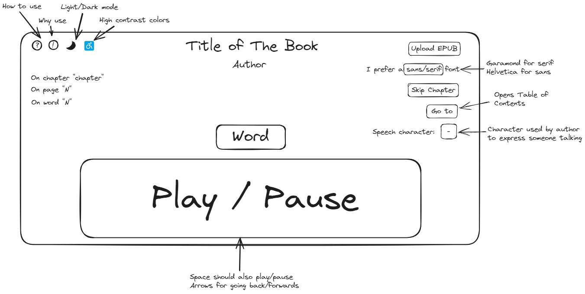
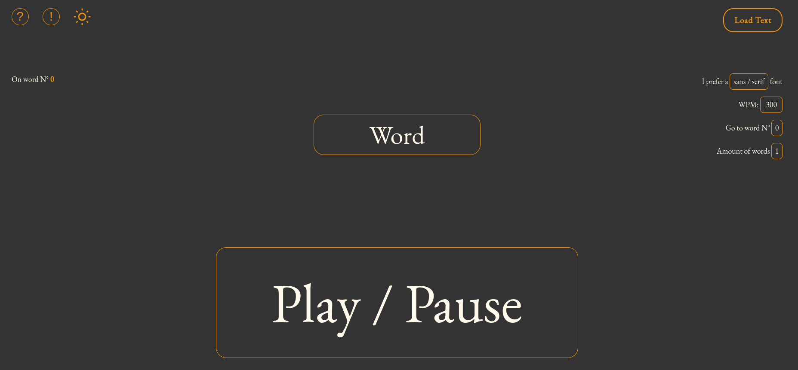

# Read for Speed

A simple web app to read text that keeps your eyes in one place while it goes through the words. The original idea was to make it so i can upload an EPUB file and read that, but then i need an EPUB parser. And why spend a few hours learning how to use dependency when you can spend months learning about the EPUB format and make your own parser? ...right?

Anyways, right now i would say i have an MVP, but this was the original sketch which i intend to follow in the future once that EPUB parser is ready:

You will see a few modifications to this design:
* __High contrast color button:__ i made it accessible from the base so it's unnecessary.
* __Speech character option:__ some text have the `-` character without an end character, so determining where it starts and ends became impossible. The idea was to color the word box differently but i gave up.
* __Amount of words input:__ i added the option to set the amount of words shown in one go, instead of fixing it to one word only.

## Why use it?
So, why would you use this app? The main reason is for read speed, you can try to search for a video on youtube about read speed tests and try it out. In short, if your eyes are focused in one point, while the words pass through them, you read faster. Since your eyes have to move, physically, which takes longer than the time a machine can pass the words for you, and also takes longer than the time your brain can process that information.

The main reasons for slow reading i found online are:

* __Sub-vocalization:__ or in other words, repeating what you read in your head.
* __Regression:__ which means not unnecessarily going back over what you read.
* __Eye Movement:__ your eyes move slower than the speed at what your brain can process information.

Now, you need to work on eliminating those actions on your own, but this app does present an easier way to do it. You should use a speed (wpm) high enough so you don't have time to _speak_ the words in your head and focus on understanding without doing that. Regression is quite simple in this app 'cause when you pause, if you don't want to go back by a lot, you should see the text you just missed/want to re-read, but do try to avoid it. As for eye movement, well... it's completely erased thanks to the app. Do try to expand the amount of words if one seems to little, but make it so you don't move your eyes.

> [!NOTE]
> My personal preference is to use 400 WPM with amounts of words set to three, maybe you can try that.

## How to use it

The sketch should give you an idea, but for now there is no `Upload EPUB` button, so here it goes:

* The `?` and `!` buttons on the top left should contain this same information found in the [why use section](#why-use-it) and on this very same section
* The `sun` / `moon` icon is the dark mode toggle, i don't have to explain that do i?
* The `Load Text` button will open a modal so you can paste your text to read, it removes all line breaks (`\n`) and trims the text. When pressing ready the first word should appear in the center
* After that you can just start reading, click on the `Play / Pause` button or press `space` to play / pause as well.
* If you want to modify the settings, then here is a briefing:
  * __I prefer a `serif/sans` font:__ this toggles the font between a serif font (Garamond) and a sans-serif font (Lato) of the __ENTIRE PAGE__, not just the text to read.
  * __`WPM` input:__ this sets the words per minute, meaning, the speed. You can also use `+` and `-` keys to increase, or decrease, the WPM by 50.
  * __Go to word N°:__ this is like a _skip_ kind of thing. You can chose the word to go to in case you were reading and had to stop (since this has no memory), just check on the left which word you left it when leaving the app.
  * __Amount of words:__ this sets the amount of words to show simultaneously at the center, with a maximum of 4 (to much would be useless).

## Downloading / Installing
You can just clone this repo with `git clone https://github.com/apacha01/read-for-speed`. This project is made with astro so when lunching the app with `npm run dev` you can visit `localhost` on port `4321` and see the page working. If you know the stack and want to make any change, feel free to do it.

### Stack
*  - The web framework for content-driven websites.
*  - A utility-first CSS framework for rapidly building custom designs.
*  - JavaScript with syntax for types.

## Future Updates
- [ ] Make page responsive.
- [ ] Make it so the center expands into several words upon pausing.
- [ ] See how to solve the speech character issue if possible.
- [ ] Add EPUB parser and the `Upload EPUB` button.
- [ ] Add more information on the left when EPUB parsing is ready.